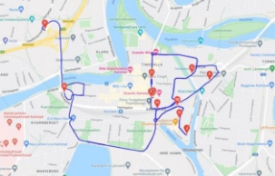
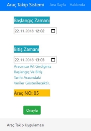

**ARAÇ TAKİP SİSTEMİ** 

`                                            `*Furkan Kadir ÖNERYILDIZ* 

**1.Giriş** 

Bu  çalışma,  temelde  birden  fazla  veri tabanı kullanılarak bir web uygulaması üzerinden kullanıcılara  araç  takip  hizmeti  sunulması amaçlanmıştır. 

### 2.Temel Bilgiler 

**2.1.Kullanılan  programlama  dilleri, kullanılan araçlar ve IDE** 

Web uygulamasının arka uç bölümünde python web framework’ü  olan  django  kullanılmıştır.  Ön  uç tarafında ise html, css ve javascript kullanılmıştır. Veri tabanı olarak, sql ve nosql kullanılmıştır, sql için  SQLite,  nosql  için  ise  mongoDB  araçları kullanılmıştır.  IDE  tarafına  ise  vscode kullanılmıştır. 

**2.2.Django Framework nedir?** 

Django,Python Programlama Dili için hazırlanmış ve BSD lisansı ile lisanslanmış yüksek seviyeli bir web çatısıdır. Basit kurulumu ve kullanımı, detaylı hata  raporu  sayfaları  ve  sunduğu  yeni  arayüz kodlama  yöntemleriyle  diğer  sunucu  yazılımı  ve çatılardan kendini ayırmaktadır. 

**2.3.Google maps API nedir?** 

Google  Maps  Platform, geliştiricilere  Google Haritalar’ı  sayfalarına  entegre  etmek,  Google Haritalar’dan  veri  almak,  basit  kullanım  veya kapsamlı  kişiselleştirmelere  olanak  sağlayan  bir Google ürünüdür. 

**2.4.NoSQL nedir?** 

NoSQL veritabanları, belirli veri modelleri için özel olarak  tasarlanmıştır  ve  modern  uygulamalar oluşturmaya  yönelik  esnek  şemalara  sahiptir. Uygun ölçekte geliştirme kolaylığı, işlevselliği ve performansıyla geniş çaplı olarak kabul görmüştür. 

**2.5.MongoDB nedir?** 

MongoDB  en  basit  tanımlamayla,  açık  kaynak kodlu  bir  NoSQL  (Not  only  SQL)  veri  tabanı uygulamasıdır.  MongoDB  Inc.  tarafından  C++ programlama  dili  kullanılarak  2009  yılında geliştirilmiş olan MongoDB, doküman tabanlı ve ölçeklenebilir bir uygulamadır. Hızlı ve açık kaynak kodlu  olması  nedeniyle,  geleneksel  ilişkisel  veri tabanlarının yetişemediği, hantal kaldığı yapılarda daha  çok  tercih  edilen  MongoDB,  tüm  dünyada popülerlik kazanmıştır. 

**2.6.SQL nedir?** 

Structured  Query  Language kelimelerinin kısaltılmışı olan SQL bir veri tabanı uygulamasıdır. Birçok  veriyi  farklı  boyutlarda  ve  farklı fonksiyonlarda barındıran veri tabanlarını yönetim sistemine  verilen  isimdir.  SQL  ile  bu verilerin yönetimi,  silinmesi,  aktif  edilmesi ve üzerinde çalışılması mümkündür. 

**2.7.SQLite nedir?** 

SQLite, SQL ile uyumlu ilişkisel bir veritabanıdır. MySQL  ve  PostgreSQL  gibi  diğer  SQL  tabanlı sistemlerin aksine SQLite, istemci-sunucu mimarisi kullanmaz.  Tüm  program,  uygulamalara  entegre edilmiş bir C kütüphanesinde bulunur. Veritabanı, yoğun kaynak kullanan bağımsız süreçleri ortadan kaldırarak  programın  ayrılmaz  bir  parçası  haline gelir. 

**2.8.MVT nedir?** 

Model:  Veritabanı  kodlarının  yazıldığı  kısımdır. Django’da  veritabanı  oluşturmak  için  SQL komutlarına ihtiyaç yoktur. Django’ya özel bir dille veritabanı oluşturulur. 

View:  Template  ve  Model  ile  bağlantılı  çalışır. Fonksiyonlar view içerisine yazılır, fonksiyonlarda gerekli  işlemler  yapıldıktan  sonra  Template içerisinde bulunan HTML dosyalarına yönlendirilir. 

Template:  Sayfaların  tasarımlarının  olduğu  ve istemcilere  sunulduğu  kısımdır.  HTML  kodları burada yazılır. 

### 3.Özet 

Yazılmış  olan  bu  web  uygulaması  müşterilere önceden verilen kullanıcı adı ve şifre ile müşteriler giriş  yaptıktan  sonra  sitenin  nav-bar  kısmında bulunan linkine tıklayarak araçlarının son 30 içinde gittiği güzergahlarını izleyebiliyorlar, eğer ayrıntılı bilgilere erişmek isterlerse de araç seçip, ardından bu  araçla  ilgili  tarih-zaman  filtrelemesi yapabiliyorlar ve araçları hakkında ayrıntılı bilgilere erişebiliyorlar.  Tüm  giriş-çıkış  kayıtları  veri tabanında kayıt ediliyor. 

### 4.Yöntem 
 

**4.1 Kurulumların Yapılması** 

Projeyi yapmaya başlamadan önce gereklilikleri yerine getirmek gerekiyordu, bunun için önce django projesi resmi siteden okunan dökümanlar yardımıyla  kuruldu,  ardından  projeye  user  ve pages adında iki uygulama eklendi. Veritabanı olarak  django  hazır  bir  sqlite3  dosyası sunuyordu, kullanıcı tarafında bulunan kullanıcı bilgileri,  giriş-çıkış  kayıtları  gibi  verilerin  bu veri  tabanında  tutulması  kararlaştırıldı,  harita verileri için isveç taksi verilerinin bulunduğu csv dosyasında dört adet araç verisi çekildi, ardından mongoDB  programı  bilgisayara  kuruldu, verilerin  arayüzde  gözükebilmesi  için  de MongoDBCompass programı kuruldu, ardından verilerin  server  tarafından  çakilebilmesi  için MongoDBCompass  kullanılarak  import  edildi ve verilerimiz server tarafında yayına başladı. 

**4.2.Kodun yazılmasına başlanması**
 

**4.2.1.User Uygulamasının Yazılması** 

Daha  önce  oluşturulan  user  uygulamasını  ayağa kaldırmak gerekiyordu, django bize hazır kullanıcı modelleri  sunduğu  için  yeniden  model oluşturulmaya  gerek  görülmedi,  bunun  için  user klasörü içinde bulunan views.py dosyasına login ve logout  fonksiyonları  yazıldı  ve bu  fonksiyonlarla bağlantılı  olacak  şekilde  html  dosyaları  yazıldı. Kullanıcı  giriş  çıkış  kayıtlarının  veri  tabanında tutulması  için  user  klasörü  içinde  bulunan models.py  içinde  kullanıcı  adları  ve  zaman bilgilerini  tutacak  bir  model  tasarlandı  ardından views.py  içinde  yazdığımız  login  ve  logout fonksiyonlarının içine kullanıcı başarılı giriş-çıkış yaptığı  koşuluyla  giriş-çıkış  zamanlarının oluşturduğumuz modele kayıt edilmesi sağlandı. 

**4.2.2.Pages Uygulamasının Yazılması** 

Kurulumlar  kısmında  oluşturduğumuz  pages uygulamasında  bulunan  views.py  dosyasında sonKonumlar, aracsec ve araclarim adinda üç adet fonksiyon yazıldı, sonKonumlar fonksiyonu nosql yayınına bağlanıyor ve giriş yapan kullanıcıya ve kullanıcıya  ait  araçlara  göre  filtreleme  yapıp  bu yayından  veri  çekiyor,  çektiği  bu  verinin  son objesine  ait  tarih  saat  bilgisini  bir  dateTime değişkenine  atıyor  ardından  bu  dateTime değişkeninden timeDelta metodu yardımıyla 30 dk çıkarıyor  ve  bunu  da  başka  bir  değişkenin  içine atıyor,  ardından  nosql  sunucusundan  çektiğimiz veriyi  bu  iki  tarih-saat  aralığına  göre  yeniden filtreliyoruz ve elde ettiğimiz bu veri kümesini bir context içine saklayıp bu context’i de return içinde render  edip  sonKonumlar.html  dosyasına gönderiyoruz. 

Gönderdiğimiz context’i alan html dosyası bunu çift süslü parantez açarak istediği yerde kullanabiliyor, haritada  çizilecek  yollar  için  javascript kullanacağımız için html içinde script tag’i açtık ve Google maps api ve Google direction api kullanarak bir harita oluşturduk ve son 30 dk içinde oluşan araç verilerini kullanıcıya görsel olarak sunduk. 

Diğer  fonksiyon  olan  aracsec  fonksiyonunda  ise, sonKonumlar.html  dosyasında  açtığımız  form tag’inden gelen aracID bilgileri yardımıyla, nosql sunucusundan araç ID’lerine göre filtreleme yapıp tarih  saat  bilgilerini  çekiyor  ve  aracsec.html dosyasına gönderiyor, kullanıcı da dafault gelen bu bilgiler  aralığında  kendi  aracı  için  tarih-saat filtrelemesi yapabiliyor. 

Kullanıcı  bu  filtrelemeleri  yaptıktan  sonra  onay butonuna basıyor, sonKonumlar.html kullanıcıdan aldığı veriyi araclarim adındaki fonksiyona POST ediyor ve araclarim fonksiyonu bu bilgileri request edip alıyor, aldığı bu bilgilerle nosql sunucusundan veri  çekerken  filtreleme  yapıyor,  yaptığı  bu filtrelemeye  göre  çektiği  verileri  araclarim.html dosyasına  gönderiyor,  veriyi  alan  html  dosyası javascript  içinde  Google  maps  api  yardımıla  bir harita  oluşturuyor  ve  kullanıcıya  sorguladığı bilgileri görsel olarak sunuyor. 

**4.3 Karşılaşılan Sorunlar Timezone Hatası** 

Orijinal csv dosyasında bulunan saat verileri, nosql sunucusunda üç saat geride gözüküyordu, bu durumu fark etmem iyi oldu aksi takdirde tüm kullanıcılara hatalı veriler iletilecekti ve bu sorunlara yol açacaktı, bu sorunu çözmek için projeye pytz kütüphanesini dahil ettim ve nosql sunucundan çektiğim tarih-saat verilerini bu kütüphane yardımıyla bulunduğum tarih-saat dilimiyle aynı yaptım. 

**views.py** 

### 5.Deneysel Sonuçlar

**Kullanıcı1’e Ait Araçların Son 30 Dk Sorgusu** 

**İki farklı aracın son 30 dakika konumları** 

**İlk Araç** 

**Kullanıcı2’ye Ait Tek Bir Araç İçin Zaman Aralığı Sorgusu** 

**İkinci Araç** 

**6.Akış Diyagramı** 

**7.Kaynak** 

[https://docs.python.org/3/ ](https://docs.python.org/3/)

[https://pypi.org/project/pytz/ ](https://pypi.org/project/pytz/)

[https://www.kaggle.com/henrikengdahl/taximove mentconcatenated ](https://www.kaggle.com/henrikengdahl/taximovementconcatenated)

[https://www.mongodb.com/ ](https://www.mongodb.com/)

[https://pymongo.readthedocs.io/ ](https://pymongo.readthedocs.io/)

[https://developers.google.com/maps/documentat ion/javascript/markers ](https://developers.google.com/maps/documentation/javascript/markers)

[https://developers.google.com/maps/documentat ion/javascript/examples/directions-waypoints ](https://developers.google.com/maps/documentation/javascript/examples/directions-waypoints)

[https://www.w3schools.com/html/ ](https://www.w3schools.com/html/)

[https://www.w3schools.com/css/ ](https://www.w3schools.com/css/)

[https://www.w3schools.com/js ](https://www.w3schools.com/js)
